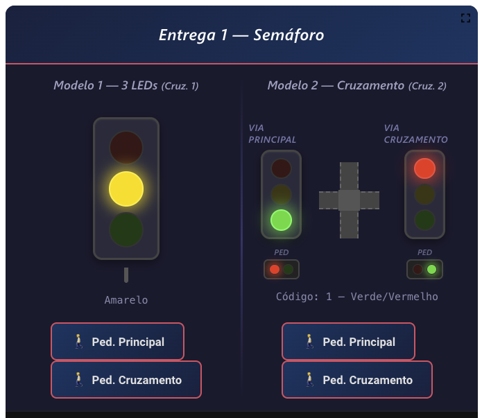

# Entrega 1 — Controle de Semáforo

Trabalho 1 - Entrega 1 da disciplina de **Fundamentos de Sistemas Embarcados (2026/1)**

**Data de Entrega (Turmas Prof. Renato):** 27/04/2026

## 1. Objetivos

Implementar um programa na **Raspberry Pi** para controlar **dois modelos de semáforo independentes e simultâneos**, utilizando GPIO para o controle dos sinais e para a leitura dos botões de pedestre. 

Os dois modelos utilizam **conjuntos de pinos GPIO separados** e são controlados **independentemente**:
- **Modelo 1 (3 LEDs)** → utiliza os pinos do **Cruzamento 1**.
- **Modelo 2 (Cruzamento completo)** → utiliza os pinos do **Cruzamento 2**.

Cada modelo possui seus próprios **2 botões de pedestre** independentes.



## 2. Cenários

### 2.1 Modelo 1 — 3 LEDs Individuais (Cruzamento 1)

Três LEDs (Verde, Amarelo e Vermelho) conectados **diretamente à GPIO** da Raspberry Pi. Cada pino controla um LED independente (nível alto = aceso, nível baixo = apagado). 

Deve ser feita a implementação de um módulo para ativação da GPIO e um código mais alto nível para implementar a máquina de estados do semáforo controlando individualmente cada LED:

```
Verde (10s) → Amarelo (2s) → Vermelho (10s) → Verde ...
```

**Comportamento do botão de pedestre:**

- Se o semáforo está **verde** e o **tempo mínimo** (5 s) já passou: muda imediatamente para amarelo;
- Se o semáforo está **verde** e o tempo mínimo **não** passou: aguarda o tempo mínimo e então muda para amarelo;
- Se o semáforo já está **amarelo** ou **vermelho**: o botão não tem efeito adicional.

<center>
<b>Tabela 1</b> — Pinos GPIO do Modelo 1 (3 LEDs → Cruzamento 1)
</center>

<center>

| Item               | GPIO RPi (Saída) |
|--------------------|:----------------:|
| LED Verde (Bit 0)  | 17               |
| LED Amarelo (Bit 1)| 18               |
| LED Vermelho (Bit 2)| 23              |

</center>

### 2.2 Modelo 2 — Cruzamento Completo (3 bits, Cruzamento 2)

Controle de um cruzamento completo via **código de 3 bits** enviado pela Raspberry Pi usando os pinos do **Cruzamento 2**.

Deve ser realizada a implementação completa do **ciclo do cruzamento** com a seguinte sequência de estados:

```
Estado 1 (Verde/Vermelho) → Estado 2 (Amarelo/Vermelho) → Estado 4 (Vermelho/Vermelho)
    → Estado 5 (Vermelho/Verde) → Estado 6 (Vermelho/Amarelo) → Estado 4 (Vermelho/Vermelho)
    → Estado 1 ...
```

<center>
<b>Tabela 2</b> — Estados dos Semáforos (código de 3 bits)
</center>

<center>

| Código | Via Principal | Via Cruzamento | Ped. Principal | Ped. Cruzamento |
|:------:|:-------------:|:--------------:|:--------------:|:---------------:|
| 0      | Amarelo       | Amarelo        | Desligado      | Desligado       |
| 1      | Verde         | Vermelho       | Vermelho       | Verde           |
| 2      | Amarelo       | Vermelho       | Vermelho       | Vermelho        |
| 3      | Amarelo       | Vermelho       | Vermelho       | Desligado       |
| 4      | Vermelho      | Vermelho       | Vermelho       | Vermelho        |
| 5      | Vermelho      | Verde          | Verde          | Vermelho        |
| 6      | Vermelho      | Amarelo        | Vermelho       | Vermelho        |
| 7      | Vermelho      | Amarelo        | Desligado      | Vermelho        |

</center>

<center>
<b>Tabela 3</b> — Temporização do Cruzamento
</center>

<center>

| Estado                        | Via Principal (s) | Via de Cruzamento (s) |
|-------------------------------|:-----------------:|:---------------------:|
| Verde (mínimo)                | 10                | 5                     |
| Verde (máximo)                | 20                | 10                    |
| Amarelo                       | 2                 | 2                     |
| Vermelho total (ambas verm.)  | 2                 | 2                     |

</center>

**Comportamento do botão de pedestre:**

- **Botão Pedestre Principal** (GPIO 25): solicita abertura da travessia na via principal. Se o sinal da via principal está verde e o tempo mínimo já passou, antecipa a mudança para amarelo;
- **Botão Pedestre Cruzamento** (GPIO 22): solicita abertura da travessia na via de cruzamento. Se o sinal da via de cruzamento está verde e o tempo mínimo já passou, antecipa a mudança para amarelo.

<center>
<b>Tabela 4</b> — Pinos GPIO do Modelo 2 (Cruzamento 2 — 3 bits)
</center>

<center>

| Item                     | GPIO RPi | Direção |
|--------------------------|:--------:|:-------:|
| Semáforo Bit 0           | 24       | Saída   |
| Semáforo Bit 1           | 8        | Saída   |
| Semáforo Bit 2           | 7        | Saída   |

</center>

## 3. Botões de Pedestre

Cada modelo possui seus próprios botões de pedestre. O sinal é normalmente em **baixa** e ativado em **alta** por 200 ms. Deve ser feita a implementação de **debounce** e **imprimir imediatamente** no terminal quando um botão for detectado.

<center>
<b>Tabela 5</b> — Pinos GPIO dos Botões de Pedestre
</center>

<center>

| Botão                             | Modelo | GPIO RPi (Entrada) |
|-----------------------------------|:------:|:------------------:|
| Pedestre Principal — Modelo 1     | M1     | 1                  |
| Pedestre Cruzamento — Modelo 1    | M1     | 12                 |
| Pedestre Principal — Modelo 2     | M2     | 25                 |
| Pedestre Cruzamento — Modelo 2    | M2     | 22                 |

</center>

Os botões podem ser acionados pelo **Painel do ThingsBoard**.

## 4. Requisitos

1. O programa deve ser desenvolvido em **Python**, **C/C++** ou **Rust**;
2. O programa deve executar **ambos os modelos simultaneamente** (pinos GPIO independentes). Opcionalmente, pode aceitar argumento de linha de comando para executar apenas um modelo;
3. O estado dos semáforos deve ser controlado **via GPIO** conforme as tabelas da Seção 2;    
4. Os botões de pedestre devem funcionar corretamente em ambos os modelos, e o programa deve **imprimir imediatamente** no terminal quando detectar o acionamento;
5. O código deve tratar adequadamente o **debounce** dos botões;
6. Fornecer **Makefile** (C/C++) ou **requirements.txt** (Python) e instruções de execução no README.

## 5. Referências

### Bibliotecas Python

- [gpiozero](https://gpiozero.readthedocs.io)
- [RPi.GPIO](https://pypi.org/project/RPi.GPIO/) — [Exemplos](https://sourceforge.net/p/raspberry-gpio-python/wiki/Examples/)
- [pyserial](https://pyserial.readthedocs.io) — comunicação serial/MODBUS

### Bibliotecas C/C++

- [WiringPi](http://wiringpi.com/)
- [BCM2835](http://www.airspayce.com/mikem/bcm2835/)
- [PiGPIO](http://abyz.me.uk/rpi/pigpio/index.html)
- [libmodbus](https://libmodbus.org/)

### Lista de Exemplos

Há um compilado de exemplos de acesso à GPIO em várias linguages de programação como C, C#, Ruby, Perl, Python, Java e Shell (https://elinux.org/RPi_GPIO_Code_Samples).