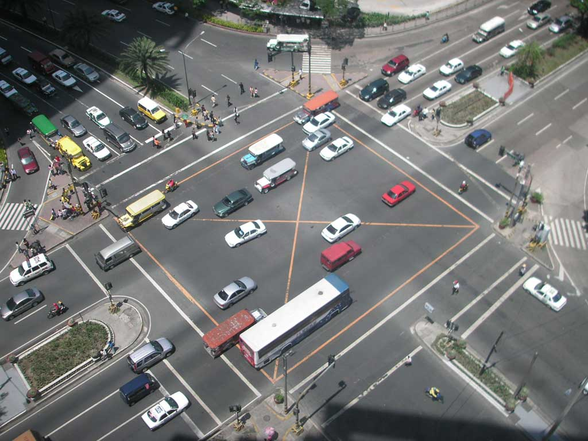

# Trabalho 1 — Controle de Cruzamentos de Trânsito com Câmeras LPR

Trabalho 1 da disciplina de **Fundamentos de Sistemas Embarcados (2026/1)**

**Datas de Entrega do Trabalho 1 (Turmas Prof. Renato):** 
- Entrega 1: 27/04/2026
- Entrega 2: 11/05/2026
- Entrega Final: 22/05/2026

## 1. Objetivos

Este trabalho tem por objetivo a criação de um **sistema distribuído** para controle e monitoramento de cruzamentos de sinais de trânsito. O aluno deve desenvolver um programa na **Raspberry Pi** que controle, via **GPIO** e via **UART/RS485**, o simulador de cruzamentos.

O sistema é composto por um **Servidor Central** e dois **Servidores Distribuídos** (um por cruzamento), todos executados como processos independentes na Raspberry Pi. O simulador do sistema de trânsito é executado em uma ESP32 em conjunto com um dashboard em tempo real (Web) que permite interação e expõe os sinais de semáforo, sensores de velocidade, botões de pedestre e câmeras LPR via GPIO e protocolo MODBUS RTU sobre RS485/UART.



Cada cruzamento possui:

- 2 sinais de trânsito (semáforos) controlados por código de 3 bits via GPIO;
- 2 botões de pedestre (um por direção), sinalizados via GPIO para a Raspberry Pi;
- 2 sensores de velocidade (2 pinos GPIO por sensor), distribuídos pela via principal e pela via de cruzamento;
- 2 câmeras LPR (*License Plate Recognition*) de velocidade, acessíveis via MODBUS RTU sobre RS485/UART.

A **Figura 1** ilustra a arquitetura geral do sistema:

```
┌──────────────────────────────────────────────────────────────┐
│                     Raspberry Pi                             │
│                                                              │
│  ┌─────────────────┐     TCP/IP     ┌────────────────────┐   │
│  │ Servidor Central│◄──────────────►│ Servidor Dist. 1   │   │
│  │                 │     TCP/IP     ├────────────────────┤   │
│  │  (Monitora e    │◄──────────────►│ Servidor Dist. 2   │   │
│  │   Coordena)     │                └────────────────────┘   │
│  └────────┬────────┘                        │                │
│           │ RS485 MODBUS                    │ GPIO           │
└───────────┼─────────────────────────────────┼────────────────┘
            │                                 │
            ▼                                 ▼
┌───────────────────────────────────────────────────────────────┐
│                          ESP32                                │
│                                                               │
│  Câmeras LPR (MODBUS slave)    Semáforos / Sensores / Botões  │
│  0x11 · 0x12 · 0x13 · 0x14    (GPIO — entradas e saídas)      │
│                                                               │
│  Widget ThingsBoard (MQTT)                                    │
│  → Modo Noite/Dia  · Carro de Emergência                      │
└───────────────────────────────────────────────────────────────┘
```

## 2. Arquitetura do Sistema

### 2.1 Servidor Central

O Servidor Central é responsável por:

- Manter conexão **TCP/IP** com os dois Servidores Distribuídos;
- Monitorar em tempo real o **fluxo de veículos** (carros/min) em cada cruzamento e via;
- Receber avisos (*push*) dos Servidores Distribuídos quando um veículo ultrapassar o limite de velocidade de **60 km/h** e, a partir desses avisos, **acionar a câmera LPR** correspondente via **MODBUS RS485** para capturar a placa e **registrar a multa**;
- Manter **log persistente de multas** (placa, velocidade, câmera, data/hora, valor da multa), gravado em arquivo;
- Comunicar-se via **MODBUS RS485** com o controlador de trânsito para ler periodicamente as seguintes informações de trânsito:
  - **Modo Noite/Dia**: quando noturno, ordenar a ambos os Servidores Distribuídos que coloquem todos os semáforos em **amarelo intermitente**;
  - **Carro de Emergência**: ao detectar a presença de veículo de emergência, ordenar a ambos os cruzamentos que **abram passagem** na respectiva via (semáforo principal verde, cruzamento vermelho) até o evento ser encerrado;
- Prover **interface** (terminal) com as informações consolidadas por cruzamento. Permitir que o usuário possa controlar **manualmente** o estado de cada semáforo e o modo amarelo intermitente.

### 2.2 Servidores Distribuídos (Cruzamentos 1 e 2)

Cada Servidor Distribuído controla um cruzamento e é responsável por:

- Controlar a **temporização dos semáforos** via GPIO (código de 3 bits para a ESP32);
- Ler os **botões de pedestre** via GPIO e antecipar a abertura do sinal quando solicitado;
- Ler os **sensores de velocidade** via GPIO, calcular a velocidade de cada veículo e manter a contagem de passagens;
- Quando um veículo for detectado **acima de 60 km/h**, enviar imediatamente um aviso (*push*) ao Servidor Central com o identificador do sensor e a velocidade medida;
- Obedecer comandos do Servidor Central para **modo noturno** (amarelo intermitente) e **modo de emergência** (abrir a respectiva via);
- Enviar periodicamente (a cada **2 segundos**) ao Servidor Central a contagem de veículos por sensor.

<!-- ### 2.3 Simulador de do Cruzamento

A ESP32 executa o firmware do simulador de cruzamentos e **não deve ser modificada pelo aluno**. Ela expõe:

- **Saídas GPIO** com os sinais dos botões de pedestre e dos sensores de velocidade (para a Raspberry Pi ler);
- **Entradas GPIO** que recebem o código de controle dos semáforos enviado pela Raspberry Pi;
- **Servidor MODBUS RTU** sobre UART/RS485 com as câmeras LPR (endereços 0x11 a 0x14);
- **Servidor MODBUS RTU** com o registrador de estado Noite/Dia e Emergência, cujos valores são atualizados pela ESP32 a partir do Widget do ThingsBoard via MQTT.

### 2.4 Widget do ThingsBoard

O Widget do ThingsBoard simula o tráfego visualmente e publica os seguintes atributos de controle (lidos pela ESP32 via MQTT e disponibilizados para a Raspberry Pi via MODBUS):

- `nightMode` — `true` = noite, `false` = dia;
- `emergency` — `true` = veículo de emergência em trânsito, `false` = normal.

O aluno **não precisa implementar** a integração MQTT com o ThingsBoard; ela já está realizada no firmware da ESP32. O Servidor Central da Raspberry Pi deve **ler** esses estados periodicamente via MODBUS. -->

## 3. Conexões GPIO (Raspberry Pi ↔ ESP32)

### 3.1 Controle de Semáforos (RPi → ESP32)

Cada cruzamento é controlado por um código de **3 bits**. A tabela abaixo define o mapeamento de pinos:

<center>
<b>Tabela 1</b> - Pinos GPIO de Controle dos Semáforos
</center>

<center>

<!-- | Cruzamento | Bit | GPIO RPi (Saída) | GPIO ESP32 (Entrada) |
|:----------:|:---:|:----------------:|:--------------------:|
| 1          | 0   | 17               | 36                   |
| 1          | 1   | 18               | 39                   |
| 1          | 2   | 23               | 34                   |
| 2          | 0   | 24               | 35                   |
| 2          | 1   | 8                | 33                   |
| 2          | 2   | 7                | 25                   | -->

| Cruzamento | Bit | GPIO RPi (Saída) |
|:----------:|:---:|:----------------:|
| 1          | 0   | 17               |
| 1          | 1   | 18               |
| 1          | 2   | 23               |
| 2          | 0   | 24               |
| 2          | 1   | 8                |
| 2          | 2   | 7                |

</center>

A tabela de estados dos semáforos decodificada pelo simulador é:

<center>
<b>Tabela 2</b> - Estados dos Semáforos (código de 3 bits)
</center>

<center>

| Código | Via Principal | Via Cruzamento | Ped. Principal | Ped. Cruzamento |
|:------:|:-------------:|:--------------:|:--------------:|:---------------:|
| 0      | Amarelo       | Amarelo        | Desligado      | Desligado       |
| 1      | Verde         | Vermelho       | Vermelho       | Verde           |
| 2      | Amarelo       | Vermelho       | Vermelho       | Vermelho        |
| 3      | Amarelo       | Vermelho       | Vermelho       | Desligado       |
| 4      | Vermelho      | Vermelho       | Vermelho       | Vermelho        |
| 5      | Vermelho      | Verde          | Verde          | Vermelho        |
| 6      | Vermelho      | Amarelo        | Vermelho       | Vermelho        |
| 7      | Vermelho      | Amarelo        | Desligado      | Vermelho        |

</center>

**Modo noturno**: enviar continuamente o código **0** (amarelo em todas as direções) com piscada em intervalo de 1 segundo (alternando entre o código 0 e o código 4).

### 3.2 Botões de Pedestre (ESP32 → RPi)

<center>
<b>Tabela 3</b> - Pinos GPIO dos Botões de Pedestre
</center>

<center>

<!-- | Botão                   | GPIO RPi (Entrada) | GPIO ESP32 (Saída) |
|-------------------------|:------------------:|:------------------:|
| Cruzamento 1 — Principal | 1                 | 26                 |
| Cruzamento 1 — Travessia | 12                | 27                 |
| Cruzamento 2 — Principal | 25                | 32                 |
| Cruzamento 2 — Travessia | 22                | 22                 | -->

| Botão                   | GPIO RPi (Entrada) |
|-------------------------|:------------------:|
| Cruzamento 1 — Principal | 1                 |
| Cruzamento 1 — Travessia | 12                |
| Cruzamento 2 — Principal | 25                |
| Cruzamento 2 — Travessia | 22                |

</center>

O sinal do botão é normalmente em **baixa** e ativado em **alta** por um intervalo de 300 a 400 ms. Deve-se implementar tratamento de *debounce*.

### 3.3 Sensores de Velocidade (ESP32 → RPi)

Cada sensor possui **dois pinos** (A e B). A passagem de um carro gera um pulso em A e, após um intervalo, um pulso em B. A velocidade é calculada pela distância entre os dois sensores físicos dividida pelo intervalo de tempo medido entre os pulsos.

$$v\;[\text{km/h}] = \frac{d\;[\text{m}]}{\Delta t\;[\text{s}]} \times 3{,}6$$

onde $d = 2\;\text{m}$ (comprimento médio do veículo simulado) e $\Delta t$ é o intervalo entre a borda de subida do pino A e a borda de subida do pino B.

> **Obs.**: no simulador, $\Delta t$ varia entre **15 ms** (velocidade alta) e **300 ms** (velocidade baixa). O sinal permanece em baixa enquanto inativo e em alta quando ativado (\___|‾|\_).

<center>
<b>Tabela 4</b> - Pinos GPIO dos Sensores de Velocidade
</center>

<center>

<!-- | Sensor | Cruzamento | GPIO RPi A | GPIO RPi B | GPIO ESP32 A | GPIO ESP32 B |
|:------:|:----------:|:----------:|:----------:|:------------:|:------------:|
| 1      | 1          | 16         | 20         | 14           | 12           |
| 2      | 1          | 21         | 27         | 13           | 23           |
| 3      | 2          | 11         | 0          | 21           | 19           |
| 4      | 2          | 5          | 6          | 18           | 5            | -->

| Sensor | Cruzamento | GPIO RPi A | GPIO RPi B |
|:------:|:----------:|:----------:|:----------:|
| 1      | 1          | 16         | 20         |
| 2      | 1          | 21         | 27         |
| 3      | 2          | 11         | 0          |
| 4      | 2          | 5          | 6          |

</center>

## 4. Integração RS485 — MODBUS RTU

O barramento RS485 é compartilhado entre as câmeras LPR e o registrador de estado (Noite/Dia e Emergência). Todos os dispositivos estão conectados ao mesmo barramento físico com endereços MODBUS distintos.

**Parâmetros da porta serial**: 115200 bps, 8N1, timeout 200–500 ms, até 3 tentativas em caso de erro.

### 4.1 Endereços dos Dispositivos

| Dispositivo                        | Endereço MODBUS |
|------------------------------------|:---------------:|
| Câmera LPR — Sensor 1              | 0x11            |
| Câmera LPR — Sensor 2              | 0x12            |
| Câmera LPR — Sensor 3              | 0x13            |
| Câmera LPR — Sensor 4              | 0x14            |
| Registrador de Estado              | 0x20            |

### 4.2 Mapa de Registradores — Câmeras LPR (0x11 a 0x14)

As câmeras LPR (*License Plate Recognition*) são os dispositivos responsáveis por registrar a placa dos veículos infratores. Neste trabalho, cada câmera está associada a um sensor de velocidade e é acionada pelo Servidor Central sempre que o Servidor Distribuído reportar a passagem de um veículo acima do limite de 60 km/h.

**Holding Registers — Função 0x03 (leitura) / 0x10 (escrita)**

| Offset | Tamanho | Descrição                                | Tipo/Formato                            |
|:------:|:-------:|------------------------------------------|-----------------------------------------|
| 0      | 1       | **Status**                               | 0=Pronto, 1=Processando, 2=OK, 3=Erro   |
| 1      | 1       | **Trigger de Captura** (escrever 1 para disparar) | 0=Idle; escrever 1 inicia captura |
| 2      | 4       | **Placa [8 chars]**                      | 4 registradores (2 bytes cada) — ASCII  |
| 6      | 1       | **Confiança (%)**                        | 0–100                                   |
| 7      | 1       | **Código de Erro**                       | 0=nenhum                                |

**Fluxo típico de captura:**

1. Servidor Central escreve **1** em *Trigger* (offset 1) via `Write Multiple Registers (0x10)`.
2. Faz *polling* em **Status** (offset 0) até **2 = OK** ou **3 = Erro** (timeout ≤ 2 s).
3. Se **OK**, lê **Placa** (offsets 2–5, 4 registradores) e **Confiança** (offset 6).
4. Escreve **0** em *Trigger* para resetar a câmera.
5. Registra a infração no log (placa, velocidade, câmera, timestamp).

> **Conversão de Placa**: cada registrador de 16 bits carrega 2 caracteres ASCII em *big-endian* (ex.: `0x4C50` → `"LP"`).

> **Atenção**: É necessário enviar os **4 últimos dígitos da matrícula** ao final de cada mensagem MODBUS, sempre antes do CRC.

### 4.3 Mapa de Registradores — Estado do Sistema (Endereço 0x20)

Este dispositivo monitora o estado do sistema a partir simulador de trânsito. O Servidor Central deve realizar a leitura periodicamente (sugestão: a cada 1 segundo).

**Holding Registers — Função 0x03 (leitura)**

| Offset | Tamanho | Descrição                           | Valores          |
|:------:|:-------:|-------------------------------------|------------------|
| 0      | 1       | **Modo Noite** (`nightMode`)        | 0=Dia, 1=Noite   |
| 1      | 1       | **Emergência** (`emergency`)        | 0=Normal, 1=Ativo|
| 2      | 1       | **Rua da emergência**               | 0=Principal, 1=Via Auxiliar 1, 2=Via Auxiliar 2|

## 5. Requisitos do Sistema

### 5.1 Servidores Distribuídos

O código dos Servidores Distribuídos deve ser desenvolvido em **Python**, **C/C++** ou **Rust**.

Cada Servidor Distribuído tem as seguintes responsabilidades:

1. **Controlar os semáforos** via GPIO (código de 3 bits) obedecendo a temporização:

<center>
<b>Tabela 5</b> - Temporização dos Semáforos
</center>

<center>

| Estado          | Via Principal (s) | Via de Cruzamento (s) |
|-----------------|:-----------------:|:---------------------:|
| Verde (mínimo)  | 15                | 5                     |
| Verde (máximo)  | 30                | 10                    |
| Amarelo         | 3                 | 3                     |
| Vermelho total  | 2                 | 2                     |

</center>

2. **Controlar os botões de pedestre** via GPIO: ao detectar o acionamento, antecipar a mudança de estado do semáforo correspondente (respeitando o tempo mínimo de verde já decorrido);
3. **Medir a velocidade dos veículos** via GPIO (sensores A e B): calcular a velocidade a partir do intervalo de tempo entre os pulsos, contar a passagem de cada veículo;
4. **Reportar ao Servidor Central** (via TCP/IP, a cada 2 segundos) a contagem de veículos por sensor;
5. Ao detectar veículo **acima de 60 km/h**, enviar imediatamente aviso (*push*) ao Servidor Central com: `{cruzamento, sensor_id, velocidade_kmh, timestamp}`;
6. Obedecer comandos do Servidor Central para **modo noturno** (amarelo intermitente) e **modo de emergência** (via principal verde, cruzamento vermelho);
7. Configurar-se automaticamente para o cruzamento 1 ou 2 a partir de um **arquivo de configuração** (pinos, porta TCP, etc.).

### 5.2 Servidor Central

O código do Servidor Central pode ser desenvolvido em **Python**, **C/C++** ou **Rust**.

O Servidor Central tem as seguintes responsabilidades:

1. **Manter conexão TCP/IP** com os dois Servidores Distribuídos;
2. **Ler periodicamente** (via MODBUS RS485, endereço 0x20) o estado Noite/Dia e o estado de Emergência;
3. Ao detectar **modo noturno**, comandar ambos os Servidores Distribuídos para ativar o **amarelo intermitente**;
4. Ao detectar **veículo de emergência**, comandar ambos os cruzamentos para **abrir passagem** na via principal até o evento ser encerrado;
5. Ao receber aviso de infração de velocidade de um Servidor Distribuído, **acionar a câmera LPR** correspondente via MODBUS RS485 e **registrar a multa** (placa, velocidade, câmera, timestamp, valor da multa) em arquivo de log;
6. Manter **histórico de passagens** de veículos por cruzamento e via;
7. Prover **interface** (terminal ou web) com as seguintes informações por cruzamento:
   - Fluxo de tráfego por sensor (carros/min);
   - Velocidade média por sensor (km/h);
   - Total de infrações de velocidade e respectivas multas;
   - Comandos manuais em que o usuário possa controlar o estado dos semáforos e o modo noturno (piscar amarelo);  
8. **Armazenar de modo persistente** (arquivo) o estado atual para que possa ser reestabelecido em caso de reinicialização.

### 5.3 Requisitos Gerais

1. Em qualquer linguagem, deve haver instruções explícitas de como instalar e executar o sistema;
2. Para C/C++, é mandatório o uso de **Makefile** com todas as dependências no projeto;
3. Cada serviço deve poder ser **iniciado independentemente** e aguardar a conexão dos demais;
4. Qualquer queda de comunicação deve ser **reestabelecida automaticamente** sem perda de função;
5. O código deve ser modular com arquitetura bem definida. Programas completos em arquivo único terão a nota de arquitetura em Zero.
5. O repositório deve conter um arquivo **README** descrevendo a instalação, configuração e uso.

## 6. Detalhes de Implementação

### 6.1 Cálculo de Velocidade

O sensor de velocidade possui dois pinos (A e B). Na passagem de um veículo:

- O pino A é ativado (borda de subida) primeiro;
- O pino B é ativado (borda de subida) após um intervalo $\Delta t$;
- A velocidade é calculada por:

$$v = \frac{2\;\text{m}}{\Delta t} \times 3{,}6 \quad [\text{km/h}]$$

No simulador, $\Delta t$ varia entre **15 ms** (≈ 480 km/h) e **300 ms** (≈ 24 km/h).

### 6.2 Modo Noturno

Quando ativado, o Servidor Distribuído deve alternar o código dos semáforos entre o estado **0** (amarelo) e o estado **4** (vermelho total / apagado) com período de **2 segundoa** (1s em cada estado), simulando o pisca-pisca amarelo.

### 6.3 Modo de Emergência

Quando ativado, os Servidores Distribuídos devem manter a respevtiva via liberada (sinal verde) até receber a desativação do Servidor Central.

### 6.4 Registro de Multas (Log)

O arquivo de log deve conter, para cada multa:

```
timestamp | cruzamento | sensor | velocidade (km/h) | câmera MODBUS | placa | confiança (%) | Valor da Multa
```

## 7. Critérios de Avaliação

<center>
<b>Tabela 6</b> - Critérios de Avaliação
</center>

| ITEM | DETALHE | VALOR |
|------|---------|:-----:|
| **Entrega 1 - Módulo da GPIO** | | |
| Módulo da GPIO | Módulo capaz de controlar a GPIO com Inputs (Por polling e por Interrupção) / Outputs (Liga/Desliga e PWM). | 1,0 |
| **Entrega 2 - Módulo da UART-MODBUS** | | |
| Módulo UART / MODBUS | Módulo capaz de enviar e receber comandos da UART via protocolo MODBUS conforme o enunciado. | 1,5 |
| **Servidor Central** | | |
| Interface de Monitoramento | Interface apresentando fluxo de tráfego, velocidade média e infrações por cruzamento. | 1,0 |
| Integração MODBUS — Estado do Sistema | Leitura periódica do modo Noite/Dia e Emergência via MODBUS (endereço 0x20) e acionamento correto dos cruzamentos. | 0,5 |
| Registro de Multas | Acionamento correto das câmeras LPR via MODBUS, captura de placa e log persistente de multas. | 1,0 |
| **Servidores Distribuídos** | | |
| Controle de Semáforos | Temporização correta dos semáforos via GPIO (Tabela 5) com suporte aos modos noturno e de emergência. | 1,0 |
| Botões de Pedestre | Detecção e resposta ao acionamento dos botões de pedestre via GPIO com debounce. | 0,5 |
| Sensor de Velocidade | Cálculo correto da velocidade, contagem de veículos e envio de aviso ao Servidor Central quando acima de 60 km/h. | 1,0 |
| **Geral** | | |
| Comunicação TCP/IP | Correta implementação da comunicação entre servidores, inicialização em qualquer ordem e reconexão automática. | 1,0 |
| Qualidade do Código | Bons nomes, modularização, ausência de busy-wait e organização geral. | 1,5 |
| **Pontuação Extra** | Qualidade e usabilidade acima da média. | 0,5 |

## 8. Referências

### Bibliotecas Python

- [gpiozero](https://gpiozero.readthedocs.io)
- [RPi.GPIO](https://pypi.org/project/RPi.GPIO/) — [Exemplos](https://sourceforge.net/p/raspberry-gpio-python/wiki/Examples/)
- [pyserial](https://pyserial.readthedocs.io) — comunicação serial/MODBUS

### Bibliotecas C/C++

- [WiringPi](http://wiringpi.com/)
- [BCM2835](http://www.airspayce.com/mikem/bcm2835/)
- [PiGPIO](http://abyz.me.uk/rpi/pigpio/index.html)
- [libmodbus](https://libmodbus.org/)

### Protocolo MODBUS

- [MODBUS Application Protocol v1.1b3](https://modbus.org/docs/Modbus_Application_Protocol_V1_1b3.pdf)
- Funções utilizadas: `0x03` Read Holding Registers, `0x10` Write Multiple Registers

### Lista de Exemplos

Há um compilado de exemplos de acesso à GPIO em várias linguages de programação como C, C#, Ruby, Perl, Python, Java e Shell (https://elinux.org/RPi_GPIO_Code_Samples).

### Link dos Dashboards

Trabalho 1 - Completo

[Dashboard completo: rasp41](https://tb.fse.lappis.rocks/dashboard/76411e30-3b44-11f1-92f3-b1657e0fa063?publicId=86d17ff0-e010-11ef-9ab8-4774ff1517e8)  
[Dashboard completo: rasp42](https://tb.fse.lappis.rocks/dashboard/7d2f5210-3d2a-11f1-92f3-b1657e0fa063?publicId=86d17ff0-e010-11ef-9ab8-4774ff1517e8)  
[Dashboard completo: rasp45](https://tb.fse.lappis.rocks/dashboard/48d16800-3d2a-11f1-92f3-b1657e0fa063?publicId=86d17ff0-e010-11ef-9ab8-4774ff1517e8)  
[Dashboard completo: rasp46](https://tb.fse.lappis.rocks/dashboard/61103950-3d2a-11f1-92f3-b1657e0fa063?publicId=86d17ff0-e010-11ef-9ab8-4774ff1517e8)  

Trabalho 1 - Entrega 1

[Dashboard Entrega 1: rasp41](https://tb.fse.lappis.rocks/dashboard/b010d410-3b63-11f1-92f3-b1657e0fa063?publicId=86d17ff0-e010-11ef-9ab8-4774ff1517e8)  
[Dashboard Entrega 1: rasp42](https://tb.fse.lappis.rocks/dashboard/9b4ab000-3d2a-11f1-92f3-b1657e0fa063?publicId=86d17ff0-e010-11ef-9ab8-4774ff1517e8)  
[Dashboard Entrega 1: rasp45](https://tb.fse.lappis.rocks/dashboard/ef36c1e0-3d2a-11f1-92f3-b1657e0fa063?publicId=86d17ff0-e010-11ef-9ab8-4774ff1517e8)  
[Dashboard Entrega 1: rasp46](https://tb.fse.lappis.rocks/dashboard/16063670-3d2b-11f1-92f3-b1657e0fa063?publicId=86d17ff0-e010-11ef-9ab8-4774ff1517e8)  